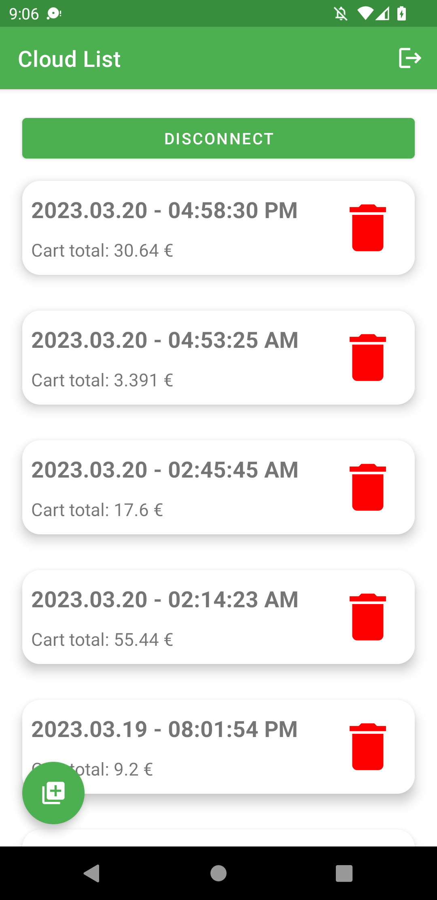
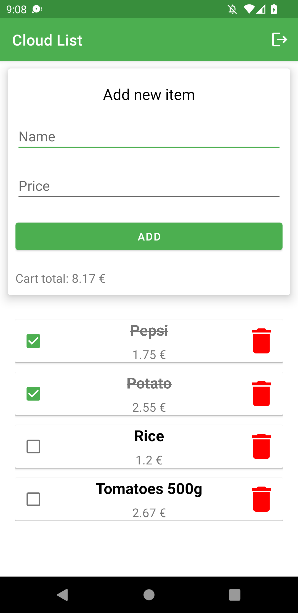

# Cloud List

This app allows you to create shopping lists that multiple users can use at once.

	
	&nbsp; &nbsp; &nbsp; &nbsp;
	

## How it works

To create a general shopping list, you need to log in to your account. If you do not have an account, you can register via your e-mail address. Once logged in, you need to create a channel or connect to an existing channel. After connecting to the channel, you can create a shopping list. When you click on the shopping list, you can start adding products. Products may have a name and a price. If you want to change the price of a product, you can delete it or create a product with the same name and a different price. You can also delete any shopping list. All data such as channels, shopping lists and products are stored in the cloud database.

You can also use a local account that does not need an internet connection. In this case you do not need to connect to a channel and all data will be stored in the database on your device.

## Tech

- MVVM - Use of LiveData and Flow
- Clean Architecture - Code split into three parts: data, domain, presentation
- Room - Use local SQLite database with coroutines
- Fragments and bottom navigation bar
